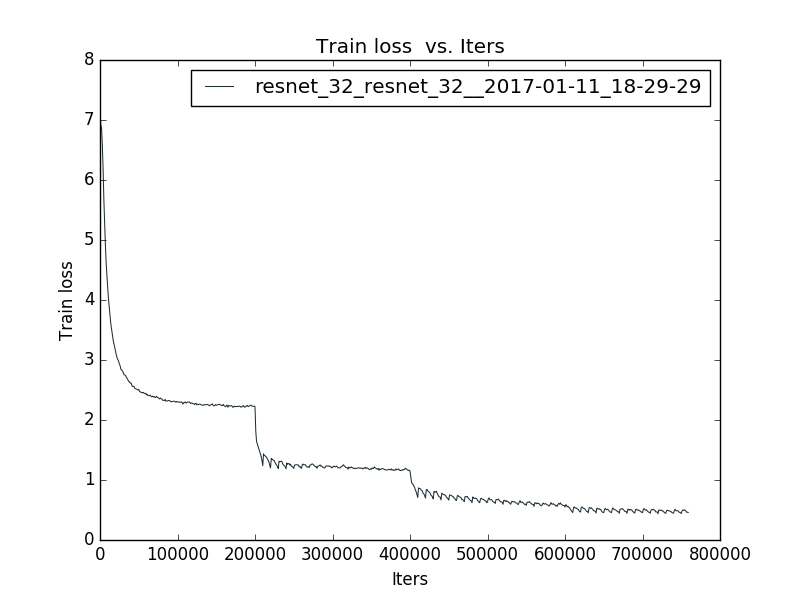

# train resnet imagenet with caffe
All models are trained on 4 GPUs with a minibatch size of 128. Testing is turned off during training due to memory limit(at least 12GB is require).
The LMDB data is obtained from the [official caffe imagenet tutorial](http://caffe.berkeleyvision.org/gathered/examples/imagenet.html)

To train a network, use train.sh. For example, train resnet-50 with gpu 0,1,2,3:

```bash
#set caffe path in train.sh
mkdir resnet_50/logs
mkdir resnet_50/snapshot
./train.sh 0,1,2,3 resnet_50 resnet_50_
```

### resnet-18
coming soon
### resnet-50
coming soon
### resnet-101
coming soon
### resnet-32
This is a bottleneck architecture,  
Since there's no strong data augmentation and 10-crop test in caffe, the results maybe a bit low.  
test accuracy: accuracy@1 = 0.67892, accuracy@5 = 0.88164  
training loss for resnet-32 is shown below:  
the trained model is provided in [release](https://github.com/yihui-he/resnet-imagenet-caffe/releases/download/v1.0/resnet_32_iter_750000.caffemodel)


### ResNet for CIFAR-10 on CAFFE
[https://github.com/yihui-he/resnet-cifar10-caffe](https://github.com/yihui-he/resnet-cifar10-caffe)

